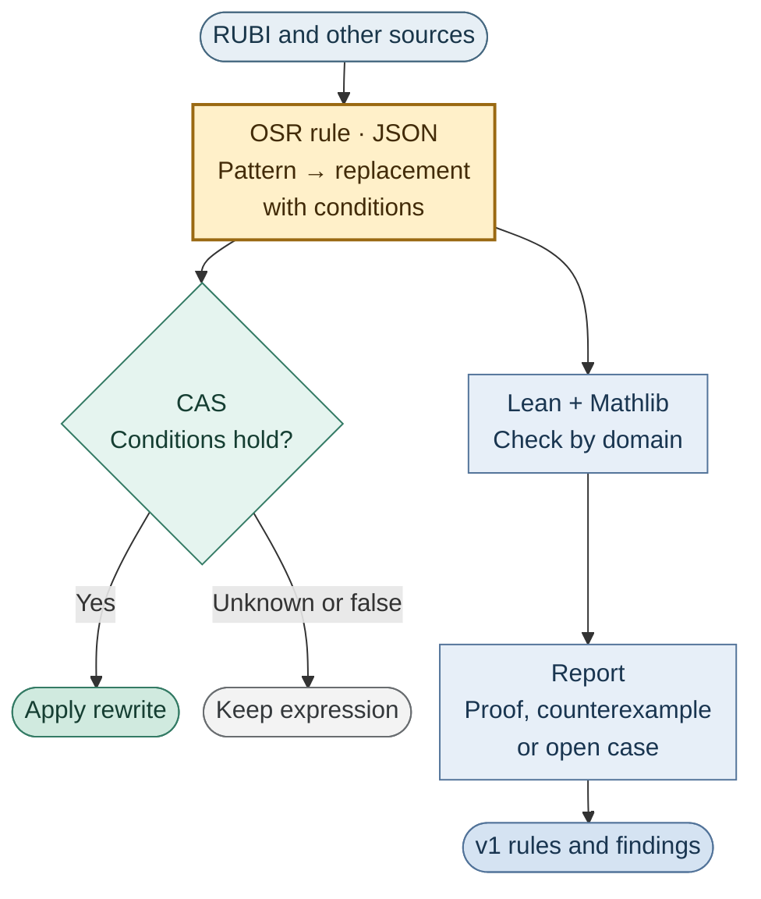

```mermaid
---
config:
  flowchart:
    nodeSpacing: 16
    rankSpacing: 28
    padding: 8
---
flowchart TB
  accTitle: How OpenSymbolicRules rules are used and verified
  accDescr: Source identities become conditional JSON rules. A CAS checks conditions before rewriting. Selected rules also receive a Lean statement and a verification report published in the findings registry.
  source(["RUBI and other sources"]):::source
  rule["OSR rule · JSON<br/>Pattern → replacement<br/>with conditions"]:::rule
  source --> rule
  rule --> cas{"CAS<br/>Conditions hold?"}:::check
  cas -->|Yes| rewrite(["Apply rewrite"]):::applied
  cas -->|Unknown or false| keep(["Keep expression"]):::pending
  rule --> lean["Lean + Mathlib<br/>Check by domain"]:::proof
  lean --> report["Report<br/>Proof, counterexample<br/>or open case"]:::proof
  report --> registry(["v1 rules and findings"]):::published

  classDef source fill:#e7eff5,stroke:#476981,color:#19364a
  classDef rule fill:#fff0c9,stroke:#9a6912,color:#422b08,stroke-width:2px
  classDef check fill:#e5f4ef,stroke:#347b65,color:#153e32
  classDef applied fill:#d0eadf,stroke:#347b65,color:#153e32
  classDef pending fill:#f3f3f3,stroke:#696d70,color:#34383b
  classDef proof fill:#e7eff8,stroke:#53749a,color:#193550
  classDef published fill:#d5e3f2,stroke:#53749a,color:#193550
```
